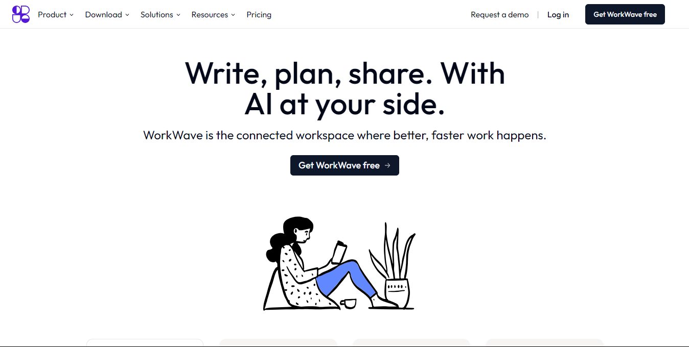

<div align="center">
  
[](https://twitter.com/intent/follow?screen_name=iamt_toby)
[](https://github.com/richdede)
[](https://www.linkedin.com/in/dee-prince-dede-970913217/)
[](https://www.instagram.com/iamt_toby/)
  <br />
  <br />

  <h2 align="center">Notion Landing Page Website</h2>

<a href="https://apple-iphone15-nu.vercel.app/"><strong>➥ Live Demo</strong></a>

</div>

<br />

### Demo Screeshots



## 📋 <a name="table">Table of Contents</a>

1. 🤖 [Introduction](#introduction)
2. ⚙️ [Tech Stack](#tech-stack)
3. 🔋 [Features](#features)
4. 🤸 [Quick Start](#quick-start)
5. 🔗 [Links](#links)
6. 🚀 [More](#more)

## <a name="introduction">🤖 Introduction</a>

This is a clone of Notion Landing Page website using Next.js, Typescript, Framer motion, illustration and TailwindCSS. It highlights the effective use of Framer motion and illustration image for displaying 

If you're getting started and need assistance or face any bugs, contact me 

  [LinkedIn](https://www.linkedin.com/in/dee-prince-dede-970913217/).

## <a name="tech-stack">⚙️ Tech Stack</a>

- Typescript.js
- OpenDooddle
- Framer motion
- Tailwind CSS

## <a name="features">🔋 Features</a>

👉 **Beautiful Subtle Smooth Animations using CSS**: Enhanced user experience with seamless and captivating animations powered by Opendoddles illustration.

👉 **Completely Responsive**: Consistent access and optimal viewing on any device with a fully responsive design that adapts to different screen sizes.

and many more, including code architecture and reusability

## <a name="quick-start">🤸 Quick Start</a>

Follow these steps to set up the project locally on your machine.

**Prerequisites**

Make sure you have the following installed on your machine:

- [Git](https://git-scm.com/)
- [Node.js](https://nodejs.org/en)
- [npm](https://www.npmjs.com/) (Node Package Manager)

**Cloning the Repository**

```bash
git clone https://github.com/richdede/notion_landing_clone.git
cd notion_landing_clone
```

**Installation**

Install the project dependencies using npm:

```bash
npm install
```

**Running the Project**

```bash
npm run dev
```

Open [http://localhost:3000](http://localhost:3000) in your browser to view the project.

## <a name="more">🚀 More</a>

### Contact

If you want to contact with me you can reach me at [LinkedIn](https://www.linkedin.com/in/dee-prince-dede-970913217/).